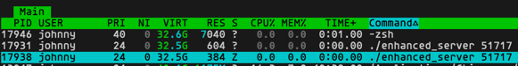

# Lab 1 Report
In this lab, we explored basic socket connection code in C. A server basically set up a listen port, and block the process to wait for clients to connect. The client needs the address (or host name) and the port number to establish the connection with the server.
With the basic code provided, we can set up a client and send a message as a stream to the server then receive a reply. 
However, the server will terminate once replied. Therefore, we made a enhancement to make it closer to a real-life server.

```C
while (1) {
    /* code */
    newsockfd = accept(sockfd, (struct sockaddr *) &cli_addr, &clilen);
    if (newsockfd < 0)
        error("ERROR on accept");
    pid = fork();
    if (pid < 0)
        error("ERROR on fork");
    if (pid == 0) {
        close(sockfd);
        communicate(newsockfd, &buffer);
        exit(0);
    } else {
        close(newsockfd);
    }
}
```
By putting accept() inside a while loop, we are able to accept multiple connection at the same time, while different connections are ruled by subprocesses created by fork().

However, above code will also cause a problem. As the server accepts more and more clients, terminated clients are not allowed to be fully dead, because main process didn't handle its exit status.

As shown above, a subprocess of server is marked with "Z" when it send a message back to its client.
To resolve this problem, we can add a default signal handling function:
```c
int main(...) {
    // Can be placed at the beginning of main()
    signal(SIGCHLD, SIG_IGN);
    ...
}
```
With the code above, signal of subprocess will be automatically ignored, therefore it can fully terminate.

Apart from using TCP/IP protocol, which send data in a continuous stream, we can also set up the server using UDP protocol by replacing accept(), read(), and write() function.
Since we won't need to establish a connection under UDP protocol, accept() is replaced by recvfrom(). Server will block itself until it receive data from a client. Basically recvfrom() is kind of like accept() and read() merged together.
And to send data, instead of using write() to write message over a shared socket, the server will use sendto() to directly send data to the client.

```C
while (1) {
    /* code */
    n = recvfrom(sockfd, buffer, 255, 0, (struct sockaddr *)&cli_addr, &clilen);
    if (n < 0) error("ERROR reading from socket");
    pid = fork();
    if (pid < 0)
        error("ERROR on fork");
    if (pid == 0) {
        printf("Here is the message: %s\n",buffer);
        n = sendto(sockfd, "Got your message", 17, 0, (struct sockaddr *)&cli_addr, clilen);
        if (n < 0) error("ERROR sendto");
        exit(0);
    } else {
        close(sockfd);
    }
}
```